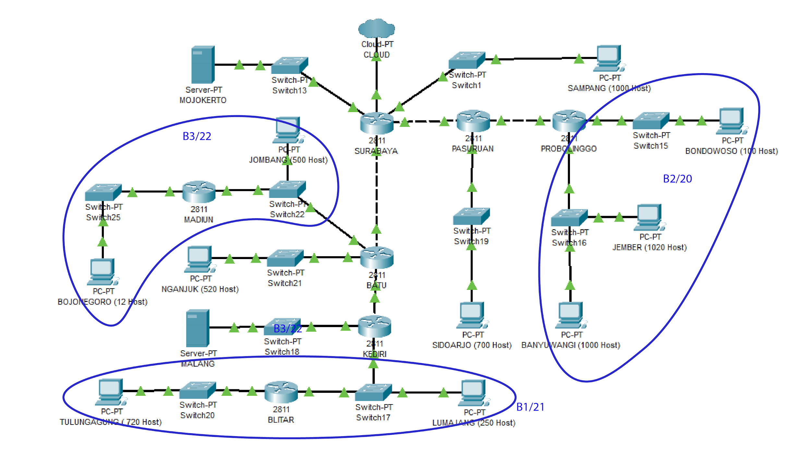

# Jarkom_Modul4_Lapres_B02

**CIDR**

Pembagian subnet di CIDR dimulai dari yag terjauh dari cloud agar
mempermudah routing sehingga didapatkan subnet sebagai berikut

**Class A**

**Class B**

**Class C**

**Class D**

**Class E**

**Class F**

**Class G**

**Dari pembagian di atas didapatkan tree sebagai berikut**

**Buat topologi.sh dengan mengikuti topologi yang telah diberikan**

**Jalankan topologi.sh, kemudian ubah semua /etc/network/interfaces
menjadi sebagai berikut**

1.  Surabaya

> \#cloud
>
> auto eth0
>
> iface eth0 inet static
>
> address 10.151.74.14
>
> netmask 255.255.255.252
>
> gateway 10.151.74.13
>
> \#sampang
>
> auto eth1
>
> iface eth1 inet static
>
> address 192.168.64.1
>
> netmask 255.255.252.0
>
> \#pasuruan
>
> auto eth2
>
> iface eth2 inet static
>
> address 192.168.192.1
>
> netmask 255.255.255.252
>
> \#batu
>
> auto eth3
>
> iface eth3 inet static
>
> address 192.168.32.1
>
> netmask 255.255.255.252
>
> \#mojokerto
>
> auto eth4
>
> iface eth4 inet static
>
> address 10.151.83.25
>
> netmask 255.255.255.252

2.  pasuruan

> auto lo
>
> iface lo inet loopback
>
> \#surabaya
>
> auto eth0
>
> iface eth0 inet static
>
> address 192.168.192.2
>
> netmask 255.255.255.252
>
> gateway 192.168.192.1
>
> \#probolinggo
>
> auto eth1
>
> iface eth1 inet static
>
> address 192.168.144.1
>
> netmask 255.255.255.252
>
> \#sidoarjo
>
> auto eth2
>
> iface eth2 inet static
>
> address 192.168.160.1
>
> netmask 255.255.252.0

3.  probolinggo

> auto lo
>
> iface lo inet loopback
>
> \#pasuruan
>
> auto eth0
>
> iface eth0 inet static
>
> address 192.168.144.2
>
> netmask 255.255.255.252
>
> gateway 192.168.144.1
>
> \#bondowoso
>
> auto eth1
>
> iface eth1 inet static
>
> address 192.168.136.1
>
> netmask 255.255.255.128
>
> \#jember&banyuwangi
>
> auto eth2
>
> iface eth2 inet static
>
> address 192.168.128.1
>
> netmask 255.255.248.0

4.  bondowoso

> auto lo
>
> iface lo inet loopback
>
> \#probolinggo
>
> auto eth0
>
> iface eth0 inet static
>
> address 192.168.136.2
>
> netmask 255.255.255.128
>
> gateway 192.168.136.1

5.  jember

> auto lo
>
> iface lo inet loopback
>
> \#probolinggo
>
> auto eth0
>
> iface eth0 inet static
>
> address 192.168.128.2
>
> netmask 255.255.248.0
>
> gateway 192.168.128.1

6.  banyuwangi

> auto lo
>
> iface lo inet loopback
>
> \#probolinggo
>
> auto eth0
>
> iface eth0 inet static
>
> address 192.168.128.3
>
> netmask 255.255.248.0
>
> gateway 192.168.128.1

7.  sidoarjo

> auto lo
>
> iface lo inet loopback
>
> \#pasuruan
>
> auto eth0
>
> iface eth0 inet static
>
> address 192.168.160.2
>
> netmask 255.255.252.0
>
> gateway 192.168.160.1

8.  sampang

> auto lo
>
> iface lo inet loopback
>
> \#surabaya
>
> auto eth0
>
> iface eth0 inet static
>
> address 192.168.64.2
>
> netmask 255.255.252.0
>
> gateway 192.168.64.1

9.  batu

> auto lo
>
> iface lo inet loopback
>
> \#surabaya
>
> auto eth0
>
> iface eth0 inet static
>
> address 192.168.32.2
>
> netmask 255.255.255.252
>
> gateway 192.168.32.1
>
> \#kediri
>
> auto eth1
>
> iface eth1 inet static
>
> address 192.168.8.1
>
> netmask 255.255.255.252
>
> \#nganjuk
>
> auto eth2
>
> iface eth2 inet static
>
> address 192.168.20.1
>
> netmask 255.255.252.0
>
> \#jombang
>
> auto eth3
>
> iface eth3 inet static
>
> address 192.168.18.1
>
> netmask 255.255.254.0

10. nganjuk

> auto lo
>
> iface lo inet loopback
>
> \#batu
>
> auto eth0
>
> iface eth0 inet static
>
> address 192.168.20.2
>
> netmask 255.255.252.0
>
> gateway 192.168.20.1

11. jombang

> auto lo
>
> iface lo inet loopback
>
> \#batu
>
> auto eth0
>
> iface eth0 inet static
>
> address 192.168.18.2
>
> netmask 255.255.254.0
>
> gateway 192.168.18.1

12. madiun

> auto lo
>
> iface lo inet loopback
>
> \#bojonegoro
>
> auto eth0
>
> iface eth0 inet static
>
> address 192.168.16.1
>
> netmask 255.255.255.240
>
> \#batu
>
> auto eth1
>
> iface eth1 inet static
>
> address 192.168.18.3
>
> netmask 255.255.254.0
>
> gateway 192.168.18.1

13. kediri

> auto lo
>
> iface lo inet loopback
>
> \#batu
>
> auto eth0
>
> iface eth0 inet static
>
> address 192.168.8.2
>
> netmask 255.255.255.252
>
> gateway 192.168.8.1
>
> \#lumajang
>
> auto eth1
>
> iface eth1 inet static
>
> address 192.168.4.1
>
> netmask 255.255.255.0
>
> \#malang
>
> auto eth2
>
> iface eth2 inet static
>
> address 10.151.83.29
>
> netmask 255.255.255.252

14. lumajang

> auto lo
>
> iface lo inet loopback
>
> \#kediri
>
> auto eth0
>
> iface eth0 inet static
>
> address 192.168.4.2
>
> netmask 255.255.255.0
>
> gateway 192.168.4.1

15. blitar

> auto lo
>
> iface lo inet loopback
>
> \#tulungagung
>
> auto eth0
>
> iface eth0 inet static
>
> address 192.168.0.1
>
> netmask 255.255.252.0
>
> \#kediri
>
> auto eth1
>
> iface eth1 inet static
>
> address 192.168.4.3
>
> netmask 255.255.255.0
>
> gateway 192.168.4.1

16. tulungagung

> auto lo
>
> iface lo inet loopback
>
> \#blitar
>
> auto eth0
>
> iface eth0 inet static
>
> address 192.168.0.2
>
> netmask 255.255.252.0
>
> gateway 192.168.0.1

17. bojonegoro

> auto lo
>
> iface lo inet loopback
>
> \#madiun
>
> auto eth0
>
> iface eth0 inet static
>
> address 192.168.16.2
>
> netmask 255.255.255.240
>
> gateway 192.168.16.1

18. mojokerto

> \#surabaya
>
> auto eth0
>
> iface eth0 inet static
>
> address 10.151.83.26
>
> netmask 255.255.255.252
>
> gateway 10.151.83.25

19. malang

> \#kediri
>
> auto eth0
>
> iface eth0 inet static
>
> address 10.151.83.30
>
> netmask 255.255.255.252
>
> gateway 10.151.83.29

**Lakukan routing di Surabaya, Pasuruan, Batu, dan Kediri**

1.  SURABAYA

> \#pasuruan
>
> route add -net 192.168.128.0 netmask 255.255.192.0 gw 192.168.192.2
>
> \#batu
>
> route add -net 192.168.0.0 netmask 255.255.224.0 gw 192.168.32.2
>
> \#malang
>
> route add -net 10.151.83.28 netmask 255.255.255.252 gw 192.168.32.2

2.  PASURUAN

> \#probilinggo
>
> route add -net 192.168.128.0 netmask 255.255.240.0 gw 192.168.144.2

3.  BATU

> \#kediri
>
> route add -net 192.168.0.0 netmask 255.255.248.0 gw 192.168.8.2
>
> \#malang
>
> route add -net 10.151.83.28 netmask 255.255.255.252 gw 192.168.8.2
>
> \#madiun
>
> route add -net 192.168.16.0 netmask 255.255.252.0 gw 192.168.18.3

4.  KEDIRI

> \#blitar
>
> route add -net 192.168.0.0 netmask 255.255.248.0 gw 192.168.4.3

**Uncomment net.ipv4.ip_forward = 1 di /etc/sysctl.conf, kemudian
jalankan sysctl -p (lakukan di semua router)**

**Lakukan iptables di Surabaya**

**Testing dengan melakukan ping its.ac.id**

**VSLM**

**Topologi awal**

Dibagi tiap subnet**

**Menghitung Total IP**

**VSLM Tree**

**Pembagian NID**

**Routing**

